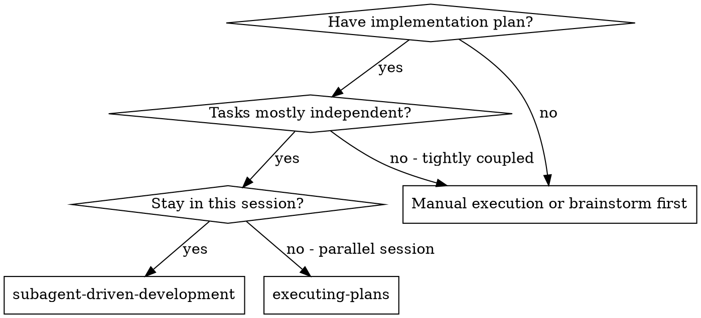
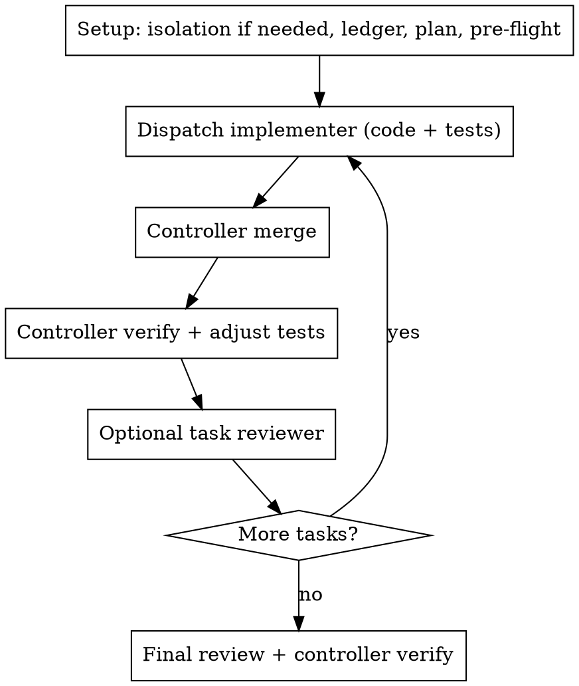

# Subagent-Driven Development

Execute a plan by dispatching a fresh implementer subagent per task. After each task, the **controller** (this session) merges the work, verifies it, and may adjust tests. Optionally dispatch a task reviewer after a green merge. Broad whole-branch review at the end.

**Why subagents:** You delegate tasks to specialized agents with isolated context. By precisely crafting their instructions and context, you ensure they stay focused and succeed at their task. They should never inherit your session's context or history — you construct exactly what they need. This also preserves your own context for coordination work.

**Core principle:** Fresh subagent per task writes **code + tests**, then **formats**. Controller **merges, verifies, refines**. Review after each task when useful. Broad final review.

**Narration:** between tool calls, narrate at most one short line — the ledger and the tool results carry the record.

**Continuous execution:** Do not pause to check in with your human partner between tasks. Execute all tasks from the plan without stopping. The only reasons to stop are the four named below, or all tasks complete. "Should I continue?" prompts and progress summaries waste their time — they asked you to execute the plan, so execute it.

**Rulings, not stalls.** A running plan does not wait on a human. Conflicts, ambiguities, plan defects, a cap you would have asked to exceed — decide them. The spec is the binding authority, the plan is its argument, and your judgment settles what neither answers. Record every decision in the ledger as `Ruling: <what you decided> — <why> — <what it costs if wrong>`, and keep going. A wrong ruling costs rework your human partner can see and undo; a session parked on a question costs their whole day and buys nothing.

Four things stop you, and only these: an irreversible or destructive operation; a security-sensitive action; a side effect outside this workspace that norms say you ask about first (a merge, a push to a shared branch, a publish); and a plan so broken that every path forward is a guess. For those, stop and ask.

## Ownership

| Role | Owns | Does not own |
|---|---|---|
| Implementer subagent | Production code, tests for the task, formatting of files they touched, short report | Full test suite, linters, git commit, dependency install, making the isolated tree runnable |
| Controller (this session) | Dispatch, merge into this workspace, review, run tests here, fix test glue, re-dispatch if impl is wrong, commit | Re-implementing the whole task unless the implementer failed |

Do not load `test-driven-development`. Tests are a deliverable the implementer writes; the controller proves them after merge.

If isolation is needed, use `using-git-worktrees` (native isolation first). That skill does **not** require installing deps or running tests in the isolated tree.

## When to Use

**vs. Executing Plans (parallel session):**
- Same session (no context switch)
- Fresh subagent per task (no context pollution)
- Controller verifies after each merge
- Faster iteration (no human-in-loop between tasks)

## The Process

## Setup

Ensure work happens in an isolated workspace when that helps: use `using-git-worktrees` to create one or verify the existing one. Never start implementation on a main/master branch without your human partner's explicit consent.

Subagents write files; they do not set up the isolated tree as a runnable project.

Conversation memory does not survive compaction. Track progress in a ledger file, not only in todos.

- Each plan owns a workspace: at skill start, run this skill's `scripts/sdd-workspace PLAN_FILE` — it prints the plan's git-ignored directory (`<repo-root>/.superpowers/sdd/<plan-basename>/`), home to every artifact for THIS plan: ledger, briefs, reports, review packages. Another plan's directory is never yours to read or write.
- Check for this plan's ledger at `<workspace>/progress.md`. If its first line names your plan file, tasks with a `Task <N>: complete` line are DONE — do not re-dispatch them; resume at the first task without one. A task whose last line is a fix round is mid-loop: resume the loop at the next round. A ledger whose first line names a different plan file — or a stray ledger at the old flat path `.superpowers/sdd/progress.md` — is another plan's progress: leave it in place and start your own, fresh.
- Create the ledger with its identity as the first line: `# SDD ledger — plan: <plan file path>`.
- The ledger is your recovery map. After compaction, trust the ledger and `git log` / `git diff` over your own recollection.

Read the plan once, note its context and Global Constraints, and create a todo per task. If the plan names a Spec, read that too.

Before dispatching Task 1, scan the plan once for conflicts. Write a table of shared files/interfaces to the ledger. Rule on everything you find before execution begins.

## Model Selection

Use the least powerful model that can handle each role. Always specify the model explicitly when dispatching if your platform supports it; an omitted model often inherits the most expensive one.

**Mechanical implementation** (1-2 files, clear spec): cheap/fast model.

**Integration and judgment** (multi-file, debugging): standard model.

**Architecture, final whole-branch review:** most capable available.

**Fix-loop escalation (rounds 4-5):** at least one tier above the stuck implementer.

**Turn count beats token price.** Cheap models that take 2–3× the turns can cost more. Mid-tier is the floor for reviewers and for implementers working from prose. When the plan contains complete code to write, transcription plus tests can use the cheapest tier.

## The Task Loop

**Batch small same-shape work.** Several tiny independent edits of the same kind → one dispatch, one review. Reserve one-dispatch-per-task for work that needs its own judgment or tests.

Everything you paste into a dispatch prompt stays in your context. Hand artifacts over as files.

**Waiting on dispatched subagents:** never poll a wait interface with short timeouts. Keep working on ledger and packaging while children run. When idle, wait in bounded stretches.

### 1. Dispatch the implementer

Record BASE (`git rev-parse HEAD`) before dispatching.

- **Task brief:** run this skill's `scripts/task-brief PLAN_FILE N`. Dispatch so the brief is the single source of requirements: (1) one line on where this task fits; (2) the brief path; (3) interfaces from earlier tasks; (4) your resolution of ambiguity; (5) the report-file path and report contract; (6) the ownership split (code+tests+format; no suite, no install, no commit).
- Exact values appear only in the brief. Never make a subagent read the whole plan file.
- The implementer never dispatches subagents — not helpers, never a reviewer.
- Never dispatch multiple implementation subagents in parallel on overlapping files.

Template: [implementer-prompt.md](implementer-prompt.md)

### 2. Handle the report and merge

Implementer statuses: **DONE**, **DONE_WITH_CONCERNS**, **NEEDS_CONTEXT**, **BLOCKED**.

Bring their edits into this workspace (native isolation apply, patch, or already-in-tree edits). A finished implementer report is not proof that tests pass.

Failed/blocked: do not merge junk. Provide context and re-dispatch, or controller-fix.

### 3. Controller verification (required)

Use `verification-before-completion`.

In **this** environment:

1. Read the diff. Spec match? YAGNI? Tests actually assert behavior?
2. Run the **focused** tests the task named. Then a broader suite if the change can leak.
3. Tests fail on env, fixtures, timeouts, snapshots, naming — **controller adjusts tests**.
4. Tests fail because impl is wrong — **re-dispatch implementer** (rounds 1–3 same agent; 4–5 fresh, stronger model) with the failing output. Implementer still does not run the full suite.
5. Small glue (imports, snapshots, config wiring) may be refined here without a subagent.

Do not trust an implementer's "tests pass" line. They were told not to run the suite.

### 4. Optional spec/quality reviewer

After a clean merge, you may dispatch a read-only reviewer with [task-reviewer-prompt.md](task-reviewer-prompt.md). Reviewer does not run the suite.

Fix rounds: [re-review-prompt.md](re-review-prompt.md) after impl fixes, still controller-verified.

### 5. Ledger + commit

Append: files merged, commands the controller ran, evidence, rulings.

**Controller commits** when a task is green — not the implementer. Implementers never `git commit` / `git push`.

## After all tasks

1. Controller runs full verification once.
2. Optional whole-branch review: `requesting-code-review`.
3. Controller refines leftovers. One more implementer dispatch only if leftover is real impl work.
4. Integrate how the human asked. `finishing-a-development-branch` is optional, not automatic.

## Common Rationalizations

| Excuse | Reality |
|--------|---------|
| "Implementer should run tests so I don't have to" | Isolated trees often lack the real env. Controller verifies after merge. |
| "Worktree means npm install + baseline tests" | `using-git-worktrees` is code isolation. Skip setup unless asked. |
| "TDD skill for red-green in the implementer" | Implementer writes tests + code. Controller proves them. |
| "Implementer should commit so we can roll back" | Controller commits after verify. Diff is the map until then. |
| "Parallelize tasks that share a file" | Serialize. Conflicts cost more than wait. |