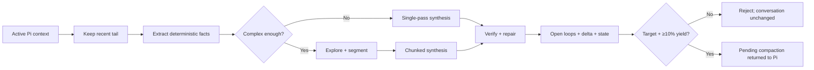

# Architecture

System-level design of `pi-smart-compact`. This is the maintainer-facing
companion to the user-facing [`README.md`](./README.md).

> **Job:** not to produce a generic recap, but to preserve the agent's working
> state so the next turn can continue with minimal loss.

## Design ideas

The design combines three ideas:

- **Agentic compaction** — let the system inspect the session, not just summarize it.
- **Kamradt-style chunking** — segment large conversations into coherent units before synthesis.
- **EESV** — **Extract → Explore → Synthesize → Verify**: facts first, synthesis second, verification last.

## Integration surfaces

Registered in [`src/index.ts`](./src/index.ts). See the README for usage; this
section is about lifecycle.

| Surface | Lifecycle |
| --- | --- |
| `/smart-compact` | Manual command. Explainable target-first preflight or direct args. Bypasses the adaptive pressure gate, not yield/verification gates. |
| `session_before_compact` | Auto hook. Returns/stages a pending summary or runs under pressure; durable commit waits for matching `session_compact`. |
| `session_compact_failed` | Pi 0.85 failure hook. Clears extension-owned staged state and records one error/cancellation outcome; older hosts simply never emit it. |
| `agent_settled` | Opt-in pressure monitor. Requests `ctx.compact()` only; it never runs EESV or consumes/stages pending state. |
| `smart_compact` tool | Agent-callable. Prepares a pending summary; never compacts mid-turn. |
| `smart_recall` tool | Searches only the current project's bounded context graph; same session/branch ranks first. |
| `smart_save_memory` tool | Persists one explicit user-confirmed project fact after secret/PII scrubbing. |

A short-lived pending compaction is staged in the [`PendingSlot`](#pending-compaction-slot)
and handed to Pi when compaction is applied.

With `autoTriggerStrategy: "settled"`, the idle hook applies finite
token/percentage, queue, in-flight, and per-session cooldown guards, then asks
Pi for a normal host compaction. Pi re-enters `session_before_compact`, which
reuses an already tool-staged summary or runs EESV exactly once under the
host's signal and timeout. The matching `session_compact` event remains the
only durable commit authority; `session_compact_failed` discards the staged
candidate without committing it. This keeps proactive triggering out of the
pending/commit state machine and preserves branch-provenance checks.

### Host dependency boundary

Pi core modules and `typebox` are wildcard peers supplied by the running host;
they are neither bundled nor duplicated as versioned development dependencies.
The lockfile pins a reproducible local baseline, and `bun run compat:pi [version]`
validates another Pi release in an isolated temporary workspace.

## Pipeline at a glance



The orchestrator ([`src/app/run-smart-compact.ts`](./src/app/run-smart-compact.ts))
threads a typed context through ten stages:

| # | Stage | Module | Transition |
| ---: | --- | --- | --- |
| 1 | prepare | `app/steps/prepare.ts` | config + provider caps + budgets; auth remains lazy |
| 2 | window | `app/steps/window.ts` | pick the prefix using a calibrated final-summary allowance |
| 3 | recover | `app/steps/recover.ts` | restore log-truncated messages |
| 4 | tier | `app/steps/tier.ts` | admission gate + none / light / full pressure label; mode owns strategy |
| 5 | extract | `app/steps/extract.ts` | prune + deterministic extraction + cache |
| 6 | synthesize | `app/steps/synthesize.ts` | single-pass or EESV |
| 7 | verify | `app/steps/verify.ts` | structural verify + repair; high-risk outcomes require successful tool evidence |
| 8 | state | `app/steps/state.ts` + `domain/yield-gate.ts` | state/open loops/resolved history/delta + final yield proof |
| 9 | persist | `app/steps/persist.ts` | stage pending, apply compaction |
| 10 | metrics | `app/steps/metrics.ts` | success / failure record |

## The typed stage machine

[`src/app/run-context.ts`](./src/app/run-context.ts) models the pipeline context
as a **state machine of branded intersection types**. Each step accepts the
previous stage type and returns the next, so reordering or skipping a step is a
**compile-time error**, not a runtime crash:

```text
RcBase
  → PreparedRc      (after prepare)
  → WindowedRc      (after window)
  → RecoveredRc     (after recover)
  → TieredRc        (after tier)
  → ExtractedRc     (after extract)
  → SynthesizedRc   (after synthesize)
  → VerifiedRc      (after verify)
  → StatedRc        (after state)
```

Each stage adds a `_prepared` / `_windowed` / … discriminator field that
carries the type-level proof and is checked by `advance()` at runtime.
Mutation is preserved: a step mutates its input object and casts it to the
next stage (no per-step copy of ~30 fields). The final alias
`RunContext = StatedRc` keeps post-`buildState` consumers readable.

This is what lets `applyCompaction` read `rc.details` with zero `!` non-null
assertions: the type system proves `buildState` has run.

## Core execution model

### Entry and context gate

`src/index.ts` owns host lifecycle wiring. Cohesive adapters in
`src/app/register-smart-compact-command.ts`, `register-smart-compact-tool.ts`,
and `model-routing.ts` validate input, resolve models, and route work into
`runSmartCompact()`. Before any expensive work, the system checks context size
against the threshold in `src/constants.ts`. Auto / tool runs are skipped while
context is small; manual `/smart-compact` uses an absolute adaptive safety tail
rather than a percentage of large model windows. Its decision-card preflight
is built from the same config snapshot, calibrated estimator, adaptive profile,
active branch, and pure window planner as execution. It compares exactly Fast,
Balanced, and Thorough; `M` changes the summary route and replans all three,
while `D` reveals technical estimator/boundary details. A plan must meet the
tail target and at least 10% projected net savings before any model call. A
pending summary for the same session is reused instead of invoking the pipeline
again. `auto` is not a fourth policy: it selects one of the three from context
pressure and deterministic extraction risk.

`app/smart-compact-policy.ts` keeps agent-tool visibility separate from
automatic compaction. The tool remains registered for immediate re-enable, but
Pi's active-tool set controls whether its schema and prompt guidance reach the
agent. Agent access is tri-state: `inherit` leaves host `/tools` and allowlists
in control, while explicit `enabled`/`disabled` choices mutate only
`smart_compact` and then report the effective host state. Full policy snapshots
are custom branch entries restored on `session_start` and `session_tree`; the
manual command is never gated.

Model routes are stage-specific but never inferred from mode. With no explicit
configuration, Explore, Synthesize, and Verify all use the selected Pi model.
`segmentationModel`, `summaryModel`, and `verificationModel` can independently
override those routes. Credentials resolve lazily immediately before each
stage's first network call and are reused for equivalent routes; call metrics
preserve the actual route.

### Keep window and preprocessing

`app/steps/window.ts` starts from Pi's compaction-aware
`buildContextEntries()` view, never the append-only session history, and builds
a content-free `CompactionWindowPlan` from the selected mode budget. The shared
`contextMessageEntries()` adapter uses Pi's `sessionEntryToContextMessages()` and
`convertToLlm()`, retaining host-visible custom/branch/compaction summaries and
original entry IDs while excluding private or context-disabled entries:

- **hard `toolCall` / `toolResult` guard** — never orphan a result from its call
- **soft recent-user/checkpoint/topical preferences** — retain raw only when the resulting suffix still fits the planned budget
- **yield contract** — projected replacement must meet its target and save at least 10% after reserving the summary budget

The same pure planner powers manual preflight and execution. A soft boundary is
recorded as relaxed rather than silently overriding the target. Long turns may
be summarized through their older prefix; if the nominal cut lands inside a
tool exchange, the planner either retains the complete pair within budget or
advances past it so the complete exchange is summarized. It also advances past
complete historical exchanges whose tool names violate the portable provider
contract; this keeps model switches from exposing an unsendable raw tail. If no
provider-safe hard boundary can meet the target, automatic/tool runs normally
return control to Pi's native compactor before any LLM call. An
already-overflowed context is
the safety exception: measured usage is mapped across active messages and EESV
keeps chunked recovery instead of sending an oversized one-shot prompt to
native summarization. Manual runs use the profile's absolute adaptive tail, so
model-window size cannot turn an explicit command into a full-context no-op.

Before summarization the pipeline keeps a deferred reference to the recovered
pre-prune messages, prunes redundant messages, loads prior continuity, checks the
extraction cache, and loads the project fingerprint. Both synthesis and backup
text use `serializeConversationText()` without the host summarizer's implicit
2,000-character tool-result cap. Structural and text redaction remain enforced;
binary attachment archival is outside this text format. The backup materializes
and writes atomically only after the matching native compaction is confirmed.

### Extract

Primary: [`src/utils/extraction.ts`](./src/utils/extraction.ts). **Zero LLM calls.**

Deterministically pulls: modified / read / deleted files, tool and bash-like
errors, retry / resolution signals, explicit & implicit decisions, constraints
and preferences, heuristic topic segments, timeline events, the main goal, and
open loops. **This is the ground truth** that synthesis and verification trust.

### Explore

Primary: [`src/phases/explore.ts`](./src/phases/explore.ts). Optional — runs only
in `thorough` mode or when `auto` selects that policy from deterministic risk. The model inspects
the conversation through a small toolset: message ranges, conversation search,
recent user messages, local context around an index, file-change lookups, and
error chains. Tool support is runtime-probed once and cached per run; if a
provider has no function calling, the system falls back to a direct structured
analysis path. The growing tool conversation is capped at three rounds, each
response is capped where the provider supports output limits, and the shared
prefix uses short-lived prompt caching.

### Synthesize

Primary: [`src/phases/synthesize.ts`](./src/phases/synthesize.ts). Three paths:

- **Deterministic zero-call** — high-confidence Fast extractions.
- **Single-pass** — when the compacted conversation fits under the configured threshold.
- **Hierarchical** — for larger sessions: merge available boundaries → split oversized semantic chunks → batch by token budget → summarize batches → assemble.

Behaviors: session-aware prompting, decision propagation across later batches,
mode-specific single-pass thresholds and output limits, provider-aware
concurrency (wave scheduling), aggregate prompt-token reservation, and a
deterministic fallback assembly when any budget or LLM call fails.

### Verify

Primary: [`src/phases/verify.ts`](./src/phases/verify.ts). Scores the summary
against deterministic extraction, continuity, explicit focus/note steering,
and source messages. It checks missing modified/read/deleted files, unresolved
errors, high-confidence constraints, weak goal coverage, missing structure,
suspicious fabricated paths, done/unresolved inconsistencies, explicit
decisions, open loops, and unsupported high-risk outcome claims. Claims such as
“tests passed” require matching source prose or a successful related tool
result.

**Repair order is intentional:** (1) deterministic patch first (free,
idempotent) → (2) one LLM patch only in `thorough` mode if still insufficient
→ (3) replace lower-scoring output with a deterministic quality floor built
only from extraction, continuity, and steering → (4) reject unless final
verification has no gaps and meets the verified threshold. Untrusted chunk
prose is never an input to the quality floor.
Final verification runs again after continuity injection. The final scalar is
reported as repaired **verification coverage**, alongside the pre-repair source
score and fallback provenance; it is not labeled as raw synthesis quality.
Verification failures retain only exhaustive content-free gap kinds and the
rejecting gate (`post-synthesis` or `post-state`) in local telemetry. Summary
evidence is never copied into failure metrics. Both gates remain mandatory:
summary-derived continuity fields cannot become evidence for their own initial
verification.
Polarity checks are symmetric: adding negation to a positive fact is rejected
just as removing negation from a prohibition is. Short negation tokens such as
`no` survive token filtering. Verbatim source clauses are not compared against
the whole instruction's polarity, while additional contradictory clauses remain
checked. Exact grounded path representations are not outcome claims; prose in
file sections is still verified. Synthesis and post-state verification use the
same summary budget for path encoding. Unresolved-error source
snippets and fallback-rendered evidence share `summaryEvidenceLine()`, so
Markdown prefixes and multiline wrapping cannot create false missing-error gaps.

## EESV hardening and control surfaces

- **Canonical summary IR** accepts recognized H1/H2/H3 headings outside fenced code, preserves Progress subsections, and merges duplicate canonical kinds before state mutation.
- **Typed verification gaps** drive mandatory deterministic repair; collision-aware path needles prevent basename cross-satisfaction. Tool/file provenance and normalized semantic evidence are indexed once per verification pass, and truncated or delimiter-incomplete LLM patches are rejected. Provenance is persisted and shown before optional approval.
- **Fine tool semantics** separate read/search/list/mutate/delete/execute operations. Pruning deduplicates only identical idempotent access signatures.
- **Unified token planning** uses a run-bound estimator with bounded process-shared provider/model calibration, counts structured tool-call arguments, preserves an adaptive recent tail, targets mode-specific post-compaction headroom, reserves bounded deterministic post-summary state sections, clamps every provider request to the model's advertised output limit, and reserves/reconciles every request against aggregate prompt/output-token caps. Missing provider usage is estimated conservatively. Tool exchanges remain atomic; oversized result bodies are head/tail bounded only for synthesis after full deterministic extraction.
- **Security boundaries** recursively scrub structured messages before host serialization or provider calls, redact secret-bearing primitive values, and scrub plus hard-cap exploration tool feedback. PII scrubbing is opt-in. Backups remain unmaterialized until confirmed apply.
- **Policy controls** include focus weighting, exact call/latency budgets, default fail-closed manual approval, online damage monitoring, and persisted open-loop overrides. Interactive review time is outside the pipeline deadline.
- **Release gates** (`bun run gate`, `bun run bench`) cover adversarial parser, verification, tool, cache, budget, scrub and damage fixtures plus bounded p95 regressions for extraction, pruning, chunking, summary parsing, and path matching.

## State, caching & persistence

Post-verification, `app/steps/state.ts` + `src/utils/state.ts` enrich the
summary, then `domain/yield-gate.ts` measures the final replacement. Planning
has already reserved the bounded post-synthesis enrichment band by reducing the
retained tail; missing the original target or 10% net-saving floor still throws
before a `StatedRc` can reach staging/apply. `session_before_compact` only stages
a passing candidate; after the host emits the matching `session_compact`,
`app/steps/persist.ts` commits reusable state, the prepared conversation backup,
and success telemetry. Aborted/unconfirmed candidates write none of them. The
UI reports `Applied` only after that correlated commit and emits a separate
warning if any durable side effect was partial.
`ui/error-format.ts` converts verification/yield failures to one bounded,
content-free diagnostic and next action, including unknown/provider errors.
Per-call categories survive in aggregated route metrics even when fallback
succeeds; raw errors never enter that telemetry. Full stacks are suppressed by
default and require restarting Pi with explicit `DEBUG=smart-compact`.
Manual execution uses a two-line widget: a colored EESV phase chain plus a
phase-specific action brief. Before Apply it explicitly says the conversation
is unchanged. Routine info toasts are hidden unless `verbose`; handled provider,
watchdog, Explore, batch, and assembly failures switch to deterministic fallback
without printing raw messages. Auto-trigger rejection logs are also debug-only,
leaving one content-free safe-fallback notice in the UI.

| Concern | Where | Notes |
| --- | --- | --- |
| Open-loop injection | `utils/state.ts` | inserted before Next Steps via the canonical parser |
| `CompactionState` | `utils/state.ts` | immutable project/session/branch-head snapshots; descendants resolve the newest matching ancestor and siblings never overwrite each other |
| Continuity Ledger | `utils/state.ts` | prior facts carry forward until positive resolution evidence or an explicit override; goal shifts become non-destructive breadcrumbs |
| Cross-compaction delta | `utils/state.ts` | "Changes Since Last Compaction" section |
| Incremental extraction cache | `utils/cache.ts` + `utils/id-fingerprint.ts` | bounded SHA-256 prefix fingerprint + tail; an exact pruned-payload match is reused directly, while incremental reuse is allowed only when the pruned prefix still matches |
| Synthesis cache | `infra/synthesis-cache.ts` | behavior key includes normalized focus, route, mode, profile limits, run-level call/input/latency limits, and reasoning |
| Session-log recovery | `utils/session-log.ts` | async bounded-memory JSONL scan with event-loop yields and a bounded path cache; bypasses pi-toolkit truncation by entry-id mapping without dropping late active-branch IDs at a fixed byte cap |
| Project fingerprint | `utils/fingerprint.ts` | locked read/merge/write; language/framework/key dirs stay bounded and `sessionCount` tracks distinct hashed session identities |
| Damage detection | `utils/damage.ts` | best-effort post-compaction regression signals |
| Context graph | `infra/context-graph.ts` | SQLite FTS5 facts + file edges; 2,000 non-structural nodes per project |

Apply-confirmed verified state is queued and duplicate updates coalesce only
for the exact project/session/branch head. Replacing an existing key refreshes
that pending value even at capacity; a divergent 65th key is rejected rather
than evicting accepted work. A microtask drains the accepted batch through one
reused SQLite connection. Every caller awaits the transaction result, so
persistence telemetry is complete only after indexing succeeds; permanent
open/write failures settle once as `context graph` failures and are never
zero-delay retried. All graph surfaces
(recall, manual memory, stats, indexing) share one process-wide, path-keyed
cached connection, so connection setup, schema checks, and migration probes
are paid once per process instead of per call; the cache is keyed by database
path so environments that relocate the cache directory (tests swapping HOME)
reopen cleanly.
`infra/context-graph.ts` adapts the same fail-closed transaction contract to
`bun:sqlite` in Bun tests and `node:sqlite` `DatabaseSync` in Pi's Node runtime;
the packed release audit exercises both. Graph data is derived and a later
cumulative state safely supersedes a failed update. Fact
occurrences are branch-head scoped; state, recall, and resolution use the
complete host-visible branch ancestry before equivalent facts are deduplicated.
Schema v1 preserves user-confirmed manual memory but resets older derived
compaction nodes once so sibling branches cannot inherit a last-writer identity.
Recall starts from FTS5 lexical matches whose rowids are the owning
`context_nodes` rowids, expands one hop through file-reference edges, then
applies session, branch, fact-kind, confidence, recency, and explicit-memory
weights. Exact equivalent facts are deduplicated before bounded output.
Resolved/superseded state is removed from the active FTS index; another
project's rows are never eligible.

**Important retention limits:** pending in-memory compaction 5 min · exploration
tool-support cache 1 h / 128 routes · token calibration 128 routes · extraction
cache 1 h · compaction state 7 d / 64 snapshots · context graph 2,000
non-structural fact nodes, 64 pending branch-head updates, and 500 active manual
memories per project · remediation hints 7 d · metrics and damage JSONL logs
5 MiB each · one exploration tool result 12,000 characters.

## Concurrency & safety model

The extension is built to run safely alongside other Pi sessions and other
extensions.

### Pending-compaction slot

[`src/app/pending-slot.ts`](./src/app/pending-slot.ts) is an encapsulated,
host-agnostic state cell (one producer, one consumer, single-threaded event
loop). `consume()` returns a discriminated result:

| `ConsumeResult.kind` | Meaning |
| --- | --- |
| `ok` | fresh payload for this session |
| `empty` | nothing staged |
| `expired` | older than the 5-minute TTL |
| `mismatch` | staged by a different session, project, or non-ancestor branch head |

Session identity comes from [`infra/session-identity.ts`](./src/infra/session-identity.ts):
a real id when the host exposes one, otherwise a per-call unforgeable
`unresolved:<uuid>` — two unresolved sessions can never collide. Apply also
requires the staged branch head to be the current head or one of its visible
ancestors, so navigation to a sibling branch cannot consume stale payload.

### Cancellation deadlines

Automatic compaction combines the host event's `AbortSignal` with its own
deadline through a shared [`ExternalCancellation`](./src/app/run-smart-compact.ts)
handle. Either source calls `abort()`, and every side-effect gate in the
orchestrator checks the shared state before writing or applying compaction.
The caller waits for safe pipeline unwind; no unsafe `Promise.race` hard return
can leave work running past the hook lifecycle.

### Filesystem & concurrency

JSON/text cache writes use [`src/infra/fs.ts`](./src/infra/fs.ts): private
artifact directories are 0700 and files are 0600; atomic temp-file + rename
prevents half-truncated readers but intentionally does not claim fsync/power-loss
durability. Append/trim operations run asynchronously, yield before synchronous
filesystem work, and hold a `mkdir`-based cross-process lock for the complete
transaction. Lock ownership is reclaimed by atomic rename, never by deleting a
possibly renewed lease in place. Sessions therefore cannot interleave bytes or
steal a live successor's lock. SQLite supplies its own WAL durability. Native
continuity handoffs are one-shot, bounded, and keyed by project + session +
branch head.

The session run lock uses file leases reclaimed when the owning PID dies.
Reclaim has a deliberate, documented TOCTOU window: two processes reclaiming
the same stale lease within milliseconds can, in one interleaving, unlink the
other's freshly created lease. The double re-read (token + inode metadata)
narrows but cannot atomically close this without an O_EXCL rename protocol;
the lock is best-effort serialization of a normally single-writer flow, not a
mutual-exclusion guarantee, and the surrounding pipeline remains fail-closed
when the lock cannot be acquired.

## Provider awareness

[`src/utils/tokens.ts`](./src/utils/tokens.ts) keeps a per-provider capability
table (Anthropic, OpenAI, Google, DeepSeek, MiniMax, Xiaomi, Mistral, xAI, …)
with unknowns falling back to a safe default + fuzzy alias matching. Each entry
drives pipeline behavior:

| Capability | Drives |
| --- | --- |
| `maxOutputTokens` | caps synthesis / patch budgets |
| `supportsTools` (`true \| false \| "probe"`) | exploration tool-call probing |
| `concurrencyLimit` | bounded batch-synthesis worker-pool width |
| `cacheStrategy` | prompt-cache retention per call |
| `timeoutMultiplier` | auto-trigger hard-timeout headroom |
| `singlePassTokenMultiplier` | single-pass vs chunked threshold |
| `tokenRatioEstimate` | token estimation; refined by per-(provider,model) **EMA calibration** |

Every provider call is raced against one aborting hard deadline so a transport
that ignores cancellation cannot keep the run lock indefinitely. Custom Codex
endpoints also receive `max_output_tokens` through Pi AI's payload hook. The
ChatGPT subscription endpoint rejects every wire output-cap field, so its
deadline is derived from the requested output allowance (15–90s) and paired
with a visible-output ceiling. Deadline failures route to the phase's
deterministic fallback.

### Provider evaluation and routing evidence

[`src/domain/provider-evaluation.ts`](./src/domain/provider-evaluation.ts)
collapses call telemetry into Explore/Synthesize/Verify routes and compares
provider/models across a deterministic context-pressure × tool-density matrix.
Only an explicitly attributed pre-repair synthesis score contributes route
quality; a run's final verifier score is never copied into Explore/Verify.
Legacy or operational-only routes still contribute latency and reliability.
Recommendations require minimum samples, ≥80% call reliability, and ≥50%
stage-local quality coverage, shrink toward neutral under low confidence, and
are advisory only.
They never mutate config or replace the selected model. The opt-in live harness
runs three identical bounded continuity scenarios across explicitly named
models.

### Privacy-safe telemetry and canary decisions

[`src/domain/telemetry.ts`](./src/domain/telemetry.ts) maps raw exceptions to a
content-free failure taxonomy, aggregates schema-v2 run quality without IDs or
conversation data, and compares an explicitly tagged `canary` cohort against
`stable` history. Reports expose total/applied counts; only non-dry,
host-confirmed applied outcomes count toward promotion. A deterministic green
release check is not promotion evidence. The gate returns Hold, Rollback, or
Promote from applied sample/quality coverage plus failure, verifier quality, p95
latency, token, heuristic-fallback, and post-compaction-damage thresholds.
Damage observations join their originating compaction by local run id, dedupe
per run, and require ≥70% stable/canary coverage before promotion. It is
advisory: rollout selection, configuration changes, and rollback remain external.

Dashboard trust calculations live in
[`src/ui/dashboard-insights.ts`](./src/ui/dashboard-insights.ts). Data
Confidence is an auditable 100-point score over sample size, schema-v2
coverage, verifier-quality coverage, required-field completeness, and
freshness; ≥85 is the high-confidence target. TUI and HTML surfaces share the
same quality-repair, stage/provider/model, failure-taxonomy, and
stable-vs-canary aggregates. Missing/legacy evidence lowers the score and
produces remediation guidance instead of being imputed.

## Dependency injection

[`src/infra/services.ts`](./src/infra/services.ts) is a per-`runSmartCompact`
service bag. Metrics, budgets, scrubbers, and prompt namespaces are isolated per
run. Production shares only bounded provider/model capability and calibration
knowledge, which contains no conversation/session data; tests use isolated
stores by default:

| Service | Role |
| --- | --- |
| `clock` | injectable wall clock (deterministic tests) |
| `llm` | LLM client seam (production does not replay failed requests) |
| `toolSupport` | process-shared in production; explicit unsupported capability, 1 h TTL / 128 routes |
| `metrics` | bounded metrics sink |
| `extractionCacheStats` | hit / miss counters |
| `tokenCalibration` | process-shared bounded per-(provider,model) EMA factors |
| `compactSessionId` | per-run prompt-cache namespace |

## Layer responsibilities

The code is organized into six layers, each with a single responsibility.

### Entry layer

| File | Responsibility |
| --- | --- |
| `src/index.ts` | extension composition root and host lifecycle hooks |
| `src/constants.ts` | version, thresholds, prompts, config keys |
| `src/types.ts` | shared types and discriminated unions |
| `domain/provider-evaluation.ts` | advisory provider scenario matrix and route telemetry aggregation |
| `domain/telemetry.ts` | privacy-safe aggregates, failure taxonomy, and canary rollback gates |

### Orchestration layer (`src/app/`)

| File | Responsibility |
| --- | --- |
| `app/run-smart-compact.ts` | top-level pipeline orchestrator |
| `app/register-smart-compact-command.ts` | manual command adapter and restore/loop actions |
| `app/register-smart-compact-tool.ts` | bounded agent-tool adapter |
| `app/register-context-tools.ts` | project-scoped recall/save-memory adapters |
| `app/model-routing.ts` | stage model resolution and explicit-model precedence |
| `app/smart-compact-policy.ts` | branch-scoped agent visibility and auto-trigger policy; owns active-tool updates |
| `app/run-context.ts` | typed stage chain (`RcBase → … → StatedRc`) |
| `app/mode-policy.ts` | Auto selector and finite Fast/Balanced/Thorough policies; legacy Aggressive maps to Fast |
| `app/pending-slot.ts` | encapsulated pending-compaction state cell |
| `app/settled-auto-trigger.ts` | guarded proactive host compact requests; no EESV or pending-state ownership |
| `app/steps/prepare.ts` | resolve config, provider caps, budgets, and cancellation; stage auth resolves lazily |
| `app/steps/window.ts` | pick the prefix using provider-calibrated synthesis and deterministic post-processing bounds |
| `app/steps/recover.ts` | recover full content for log-truncated messages |
| `app/steps/tier.ts` | admission gate + context-pressure label (none / light / full); modes own execution depth |
| `app/steps/extract.ts` | pruning + deterministic extraction with incremental cache |
| `app/steps/synthesize.ts` | single-pass / EESV synthesis |
| `app/steps/verify.ts` | structural verification + repair with tool-result trust boundaries |
| `app/steps/state.ts` | enrich summary with state, open loops, and recent resolved-error history |
| `app/steps/persist.ts` | apply compaction, save fingerprint, persist state |
| `app/steps/metrics.ts` | record success / failure metrics |

### Domain layer (`src/domain/`)

Pure semantics — no I/O, no async, no globals.

| File | Responsibility |
| --- | --- |
| `domain/summary-schema.ts` | canonical section kinds + heading classification |
| `domain/summary-parse.ts` | parse/render canonical H1/H2/H3 sections; merge duplicates; placement (`before`/`after`) |
| `domain/tool-semantics.ts` | fine tool operation taxonomy with broad compatibility wrapper |
| `domain/scrub.ts` | pure secret/PII redaction primitives and run-scoped scrubber |

### Algorithm layer (`src/phases/`)

| File | Responsibility |
| --- | --- |
| `phases/explore.ts` | targeted exploration with tool-call probing |
| `phases/synthesize.ts` | chunking, single-pass compact, batch summarization, assembly |
| `phases/verify.ts` | typed gap detection, collision-safe coverage, deterministic/LLM repair |

### Infrastructure layer (`src/infra/`)

All external-world interaction.

| File | Responsibility |
| --- | --- |
| `infra/fs.ts` | atomic writes, advisory locks, and yielding async append/trim |
| `infra/paths.ts` | canonical cache/session/backup paths |
| `infra/git.ts` | cached git-root discovery |
| `infra/clock.ts` | injectable wall clock |
| `infra/llm-client.ts` | LLM seam, custom-Codex wire cap, and ChatGPT Codex stream watchdog |
| `infra/services.ts` | per-run services container |
| `infra/session-identity.ts` | robust session-id resolution with opaque `unresolved:` fallback |
| `infra/ai-messages.ts` | validated message upcasts and recursive pre-serialization redaction |

### Utility layer (`src/utils/`)

| File | Responsibility |
| --- | --- |
| `utils/extraction.ts` | deterministic fact extraction (files, errors, decisions) |
| `utils/pruning.ts` | redundancy removal on the message list |
| `utils/state.ts` | structured state, open loops, delta, pinned-path preservation |
| `utils/config.ts` | validated config loading and mtime-keyed cache |
| `utils/helpers.ts` | batching, compaction boundaries, and extraction rendering helpers |
| `utils/backups.ts` | backup persistence, listing, and restore message construction |
| `utils/cache.ts` | metrics log + extraction prefix cache |
| `utils/fingerprint.ts` | project fingerprinting (language, framework, deps) |
| `utils/damage.ts` | post-compaction regression signals + remediation hints |
| `utils/id-fingerprint.ts` | compact SHA-256 fingerprint of entry-id arrays |
| `utils/file-needles.ts` | path-suffix needles for error→file attribution |
| `utils/file-ref-detect.ts` | fabricated file-reference detection (SemVer-rejecting) |
| `utils/session-log.ts` | streaming JSONL parser for the Pi session log |
| `utils/tokens.ts` | per-(provider,model) token estimation with EMA calibration |
| `utils/type-guards.ts` | runtime validators for cross-version compatibility |
| `utils/logger.ts` | stderr-prefixed log shim |
| `utils/lru.ts` | small bounded LRU cache primitive |

### UI layer (`src/ui/`)

| File | Responsibility |
| --- | --- |
| `ui/overlays.ts` | progressive preflight, semantic phase progress, and approval review |
| `ui/metrics-dashboard-overlay.ts` | interactive metrics dashboard screen |
| `ui/backup-overlays.ts` | backup picker, viewer, and restore action screen |
| `ui/open-loops-overlay.ts` | persisted open-loop manager |
| `ui/settings-overlay.ts` | session/branch policy editor for agent access and automatic compaction |
| `ui/dashboard-format.ts` | shared pure formatters for metrics surfaces |
| `ui/dashboard-insights.ts` | Data Confidence, quality/provider drilldowns, and canary trust views |
| `ui/metrics-report.ts` | text report + local HTML metrics dashboard |

## Design principles

The architecture intentionally biases toward safety:

- deterministic extraction before any synthesis
- adaptive exploration instead of always-on tool use
- verified file lists and error context
- deterministic repair before additional LLM calls
- hallucinated file-reference detection
- stateful tracking of open loops and cross-compaction deltas
- tool-driven compaction never compacts mid-turn
- summaries preserve exact file paths and identifiers where possible; saturated file lists use budgeted path tails plus collision-checked digests while scoped state retains full paths
- the recent tail stays live outside the compacted region

## Extending the system

When adding features, prefer this order:

1. extract more deterministic signal if possible
2. enrich exploration only when needed
3. keep synthesis prompts structured and bounded
4. strengthen verification before increasing model dependence
5. update tests and docs in the same change
